# Uczenie przez wzmacnianie modelu Qwen 0.5B

Celem tego projektu jest wytrenowanie modelu **Qwen 0.5B**, ogólnego dużego modelu językowego z 0,5 miliarda parametrów do rozwiązywania zadań logicznych oraz matematycznych poprzez trening na polskim zbiorze danych wygenerowanym przy pomocy polskiego modelu **Bielik**. Trening wykorzystuje metody **SFT (Supervised Finetuning)**, **RL (Reinforcement Learning)** oraz **GRPO (Group Relative Policy Optimization)** używanego między innymi przy treningu modeli takich jak **DeepSeek R1** oraz jego pierwowzoru **DeepSeek R1-Zero** trenowanego tylko przy użyciu metody **GRPO**.

## Użyte biblioteki:
- **PyTorch**
- **Weight & Biases (wandb)**
- **Hugging Face Transformers**
- **TRL (Transformer Reinforcement Learning)**

## Generowanie datasetu
Dataset do treningu został wygenerowany przy pomocy polskiego modelu **Bielik-11B-v2**. Wzorowany był na zbiorze [GSM8K](https://github.com/openai/grade-school-math) od **OpenAI**, ale został dostosowany do potrzeb projektu. Mimo błędów merytorycznych lub trochę niezorganizowanych kroków w niektórych zadaniach, model poradził sobie z tym zadaniem bardzo dobrze. Niestety model nie zawsze podawał poprawne odpowiedzi oraz nie zawsze podawał odpowiedzi w poprawnym formacie, więc w razie potrzeby zostały one poprawione ręcznie. ~75% odpowiedzi jednak było poprawne bez potrzeby ich poprawiania. Wygenerowane zbiory do treningu oraz testu znajdują się w plikach `train.jsonl` oraz `test.jsonl`.

`cot_outputs` zawiera plik z SHA256 dla każdego z pytań, który zawiera tagi `<reasoning>` oraz `<answer>`. Nazwa pliku dla każdego z pytań jest wyznaczana przez SHA256 pytania. Przykłady te wykorzystywane są do treningu SFT.

[dataset-polish-math](https://github.com/Comtegra/polish-math-dataset/)

## Trening
Trening modelu w 100% odbył się na platformie [Comtegra GPU Cloud](https://cgc.comtegra.cloud/) z użyciem karty **A5000**. Ze względu na dość mały zbiór danych oraz małą liczbę parametrów modelu, trening nie wymagał długiego czasu, ani mocniejszego sprzętu. Trening odbył się w 3 etapach:

1. **SFT** (Supervised Fine-Tuning)
2. **RL** (Reinforcement Learning)
    - 2.1. **GRPO** (Group Relative Policy Optimization)

## Omówienie
### Trening SFT
Problemem z tak małymi modelami jak **Qwen 0.5B** jest to, że są one zbyt małe, aby ciągle podążać za instrukcją generowania tagów `<reasoning>` oraz `<answer>`. Bez tych tagów nie jesteśmy w stanie nadać mu nagrody za prawidłową odpowiedź oraz format podczas treningu **GRPO**. Do tego właśnie używany jest trening **SFT**, aby nauczyć model te tagi generować.

Nie jest to etap wymagany, co pokazał nam trening modelu **DeepSeek R1 Zero**, jest to jednak etap, który pomaga rozwiązać problemy z czytelnością oraz miksowaniem języków w modelach. W przypadku **Qwena 0.5B** znacznie przyśpieszy i polepszy wyniki **GRPO**, ponieważ model będzie zawsze odpowiadał z tagami, co w konsekwencji pozwoli mu uzyskać więcej nagród i ułatwi ocenę podczas treningu **GRPO**.

### Trening GRPO
Tutaj bardzo podobnie jak w przypadku modelu **DeepSeek R1** oceniamy model za prawidłową odpowiedź oraz jej format (zawarcie tagów `<answer>` oraz `<reasoning>`). Jeśli odpowiedź zgadza się dokładnie, model dostaje najwyższą nagrodę, jeśli odpowiedź jest prawidłowa, jednak nie jest dokładnie w oczekiwanym formacie zwykłej cyfrowej odpowiedzi np. **`<answer>4</answer>`** model dostaje trochę mniejszą nagrodę.

Model nagradzamy również za samo zawarcie tagów. Nagroda jest dość mała, ponieważ model po wcześniejszym treningu **SFT** nie ma z tym zadaniem większych problemów, lecz na wszelki wypadek, żeby nie zapominał, że musi to robić dostaje jakiś benefit.

## Uruchomienie
Kroki do wykonania przed uruchomieniem notebooka:

1. `pip install wandb`
2. `python -m pip install --upgrade pip`
3. `pip uninstall typing_extensions`
4. `pip install typing_extensions`
5. `pip install ipywidgets`
6. Uruchomienie notebooka

## Wyniki

### Pre-SFT
#### Accuracy: 3.33% (1/30)
==================================================
#### Pre-SFT Accuracy: 3.33%

### Post-SFT
#### Accuracy: 30.00% (9/30)
==================================================

####  Post-SFT Accuracy: 30.00%
#### Improvement after SFT: 26.67%

### Post-GRPO 
#### Accuracy: 53.33% (16/30)
==================================================

#### Post-GRPO Accuracy : 53.33%
#### Improvement after GRPO: 50.00%

Model po treningu GRPO osiągnął 53.33% dokładności, co jest znacznie lepszym wynikiem niż w poprzednich etapach. W porównaniu do wyniku pre-SFT, model poprawił swoje wyniki o 50% i był w stanie rozwiązać ponad połowę zadań.

## Wandb
### format_reward
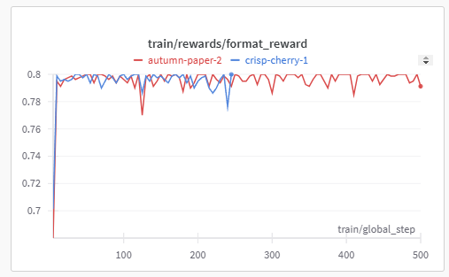
### correctness_reward
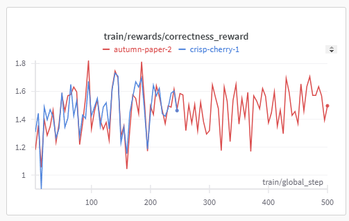
### reward_std
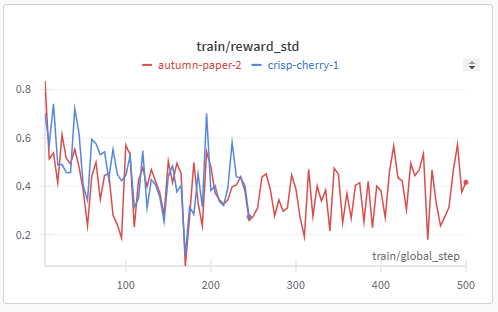
### reward
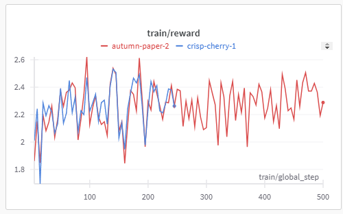
### loss
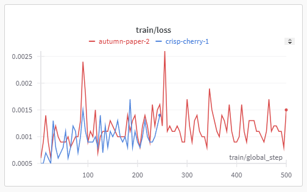
### learning_rate
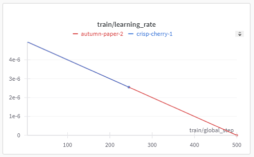
### kl
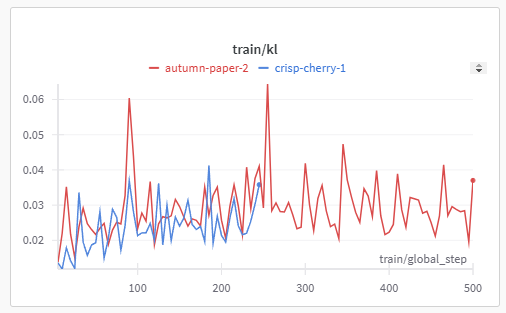
### grad_norm
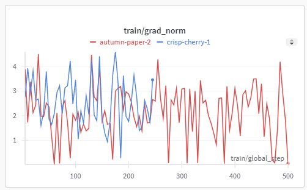
### global_step
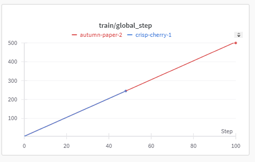
### epoch
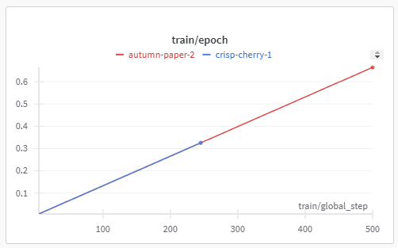
### completion_length
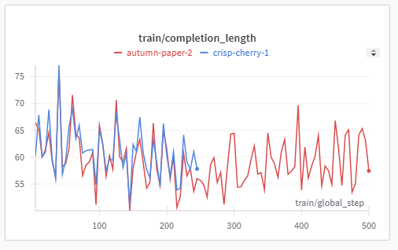

## Prompt
```
Stwórz dataset zawierający 20 przykładów zadań matematycznych w języku polskim. Każde zadanie powinno wymagać od 2 do 8 kroków do rozwiązania i opierać się na wykonywaniu kolejnych, elementarnych obliczeń z użyciem podstawowych operacji arytmetycznych (+, −, ×, ÷). Problemy mają być wystarczająco proste, aby mogły zostać rozwiązane przez bystrego ucznia gimnazjum, ale jednocześnie powinny wymagać wieloetapowego rozumowania matematycznego.
Wygenerowane przykłady muszą być w formacie .json , w którym każda linia zawiera pojedynczy obiekt JSON o następującej strukturze:
{"question": "<treść zadania>", "answer": "<pełne rozwiązanie wraz z kolejnymi krokami obliczeń, zapisane w jednej linijce, bez podziału na kilka linii; na końcu odpowiedzi dodaj wynik w formacie '#### wynik'>"}

Ważne wymagania:
Wszystkie przykłady muszą być napisane po polsku (zarówno treść zadania, jak i rozwiązanie).
Obliczenia muszą być zapisane w znacznikach << >>, np. 110 / 11 = <<110/11=10>>10 liści.
Ostateczna odpowiedź powinna być oddzielona od rozwiązania delimiterem ####, np. ####10.
Format JSON musi być zachowany – każda linia powinna być pojedynczym obiektem JSON bez zbędnych znaków nowej linii.
Przykładowy format (nie tłumacz poniższych przykładów, tylko zachowaj podobny styl dla polskich zadań):
{"question": "Janet’s ducks lay 16 eggs per day. She eats three for breakfast every morning and bakes muffins for her friends every day with four. She sells the remainder at the farmers' market daily for 2perfreshduckegg.Howmuchindollarsdoesshemakeeverydayatthefarmers ′ market?", "answer": "Janetsells16−3−4=<<16−3−4=9>>9duckeggsaday. Shemakes9_2=<<9_2=18>>18everydayatthefarmer’smarket.####18"} {"question": "A robe takes 2 bolts of blue fiber and half that much white fiber. How many bolts in total does it take?", "answer": "Ittakes2/2=<<2/2=1>>1boltofwhitefiber. Thesumoffabricis2+1=<<2+1=3>>3boltsoffabric.####3"} {"question": "Josh decides to try flipping a house. He buys a house for 80,000 and then puts in $50,000 in repairs. This increased the value of the house by 150%. How much profit did he make?", "answer": "Thetotalcostis80,000+50,000=<<80000+50000=130000>>130000. Theincreaseis80,000*1.5=<<80000*1.5=120000>>120000. Thenewvalueis120,000+80,000=<<120000+80000=200000>>200000. Theprofitis200,000−130,000=<<200000-130000=70000>>70000.####70000"}
Wygeneruj 10 takich przykładów w języku polskim, zachowując powyższe zasady i formatowanie.
```

## Źródła:
[Repozytorium theLMbook - Andriy Burkov](https://github.com/aburkov/theLMbook)

[DeepSeek-R1](https://github.com/deepseek-ai/DeepSeek-R1/blob/main/DeepSeek_R1.pdf)

[DeepSeek R1 and R1-Zero Explained](https://thelmbook.com/articles/#!./DeepSeek-R1.md)

[DeepSeekMath](https://arxiv.org/pdf/2402.03300)


## [Comtegra S.A.](https://comtegra.pl/)
Comtegra jest integratorem systemów informatycznych z siedzibą w Polsce, specjalizującym się w różnych aspektach technologii informatycznych, w tym w przechowywaniu i zarządzaniu danymi, bezpieczeństwie informacji i budowie sieci. Założona w 1999 roku, Comtegra stała się znaczącym graczem na polskim rynku IT, świadcząc usługi takie jak rozwiązania do tworzenia kopii zapasowych, cyberbezpieczeństwo i technologie wirtualizacji. Firma kładzie nacisk na integrację sztucznej inteligencji z operacjami biznesowymi w celu usprawnienia zarządzania danymi i procesów decyzyjnych.